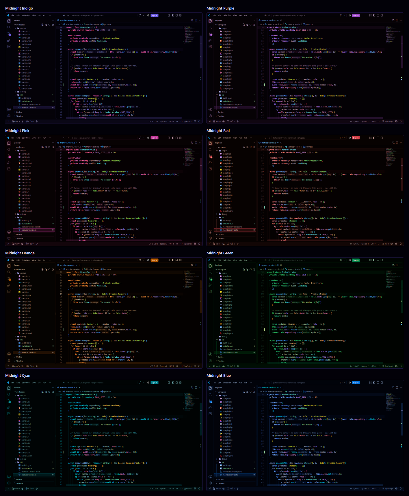
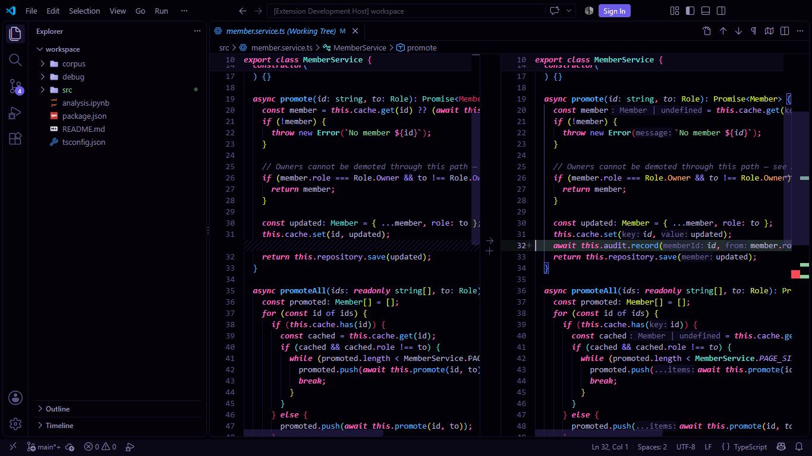
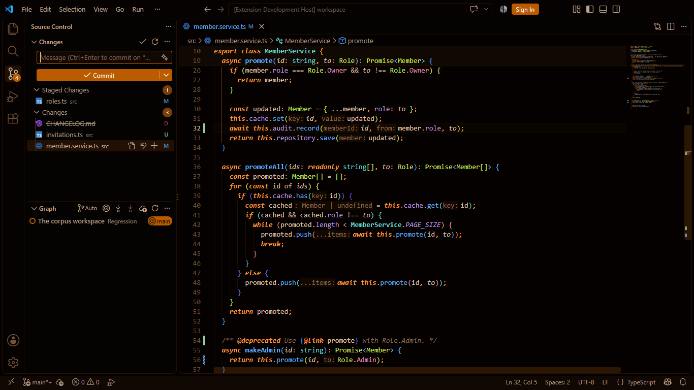
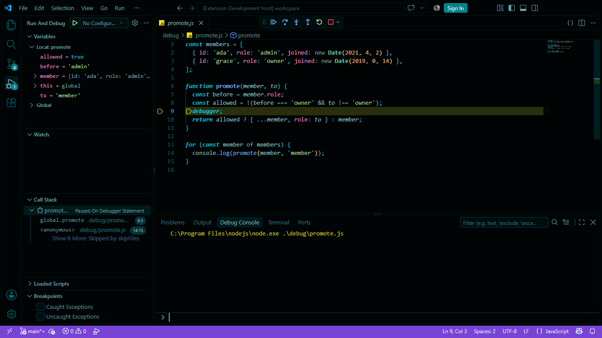
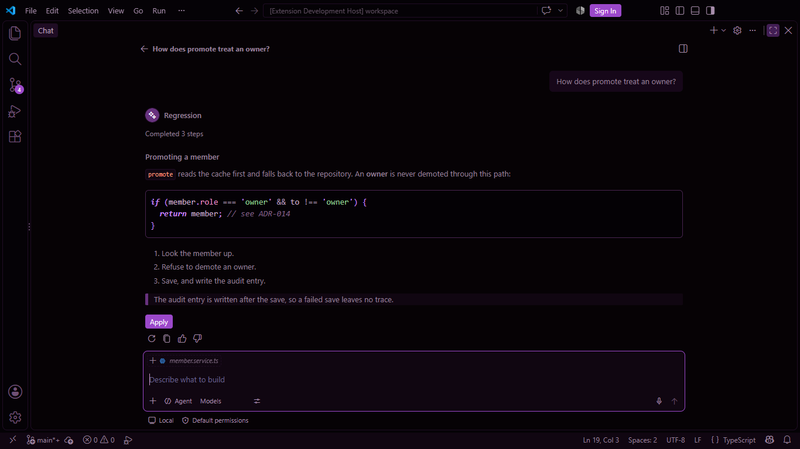
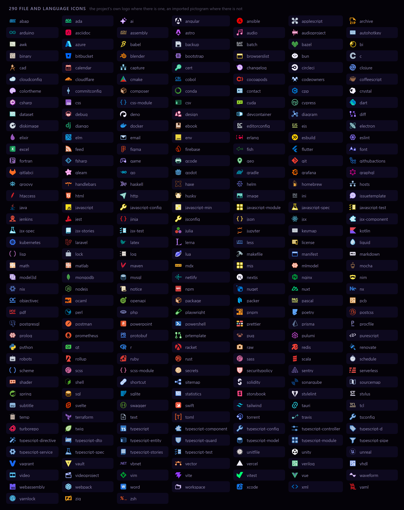
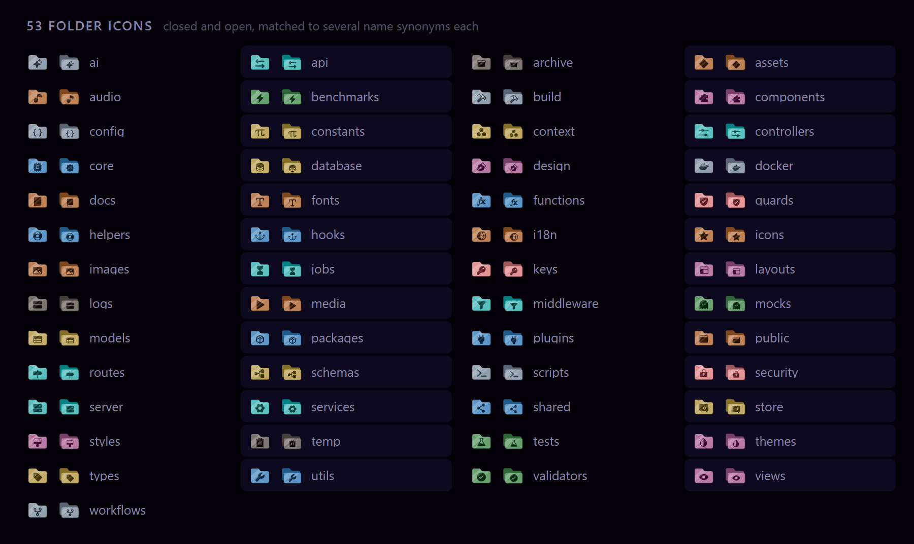

# Midnight Indigo

[](https://marketplace.visualstudio.com/items?itemName=diguu-rl.midnight-indigo)
[](https://marketplace.visualstudio.com/items?itemName=diguu-rl.midnight-indigo)
[](https://marketplace.visualstudio.com/items?itemName=diguu-rl.midnight-indigo&ssr=false#review-details)
[](LICENSE)

Um tema ultra-escuro para o Visual Studio Code em oito cores, com um conjunto de ícones de arquivo construído sobre os logotipos oficiais das linguagens. [Read in English](README.md).

**[Instalar pelo Visual Studio Marketplace →](https://marketplace.visualstudio.com/items?itemName=diguu-rl.midnight-indigo)**


O editor fica em `#020108` — quase preto, com o tom do tema — para que as cores continuem saturadas sem ofuscar ao longo de uma sessão longa. O código é a coisa mais clara e mais colorida da tela; tudo ao redor, da barra lateral ao terminal e ao chat, faz parte do mesmo desenho e diz o que significa com o mínimo de cores possível.

## O que vem incluído

Uma extensão só. Instale uma vez, escolha um tema de cores e ative os ícones.

| | |
| --- | --- |
| **Midnight Indigo**, **Purple**, **Pink**, **Red**, **Orange**, **Green**, **Cyan**, **Blue** | Oito temas de cores, cada um definindo 877 cores do VS Code, 75 regras TextMate e 59 regras de tokens semânticos |
| **Midnight Icons** | Um tema de ícones de arquivo: 305 ícones de arquivos e linguagens e 53 pastas, associados a 636 extensões, 372 nomes de arquivo e 118 linguagens — compartilhado pelos oito temas |

## Oito cores, um tema


As oito são um tema em oito cores: a mesma estrutura, as mesmas regras, o mesmo piso de legibilidade, de modo que trocar de cor nunca significa trocar para algo que se comporta de outro jeito. Cada paleta é desenhada para o seu próprio matiz, e não tingida a partir de outra. Uma string é verde onde a família deixa espaço para o verde, e algo deliberado onde não deixa — no Midnight Green as strings são verde-amareladas, porque o verde é do próprio tema.

O **Midnight Indigo** é o original. Suas cores são mantidas, por um check no build, no que a v3.0.0 publicou; as poucas que mudaram desde então mudaram de propósito, por legibilidade ou significado, e cada uma está registrada com o motivo.



Como as paletas são feitas está no [**sistema de cores**](docs/COLOR-SYSTEM.pt-BR.md).

## O workbench inteiro

Cada parte do VS Code é desenhada pelo tema, e não deixada nos padrões do VS Code: menus, o command center, abas, notificações, o editor de Settings, notebooks, depuração, testes, o terminal, diffs, merges, o grafo do Source Control, threads de comentário, chat, inline chat, edições sugeridas e a janela de Agents.

Uma cor que significa algo significa isso em todo lugar. **Vermelho** é erro — o squiggle, o teste que falhou, o vermelho do terminal e uma linha removida são um só vermelho, e nenhuma palavra-chave é desenhada nele. **Amarelo** é aviso e conflito, **azul** uma alteração, **verde** uma adição ou um teste que passou. A IA fala na cor de destaque do próprio tema, e só onde ela age.

| | |
| --- | --- |
|  |  |
| Um diff, no Indigo | Source Control, no Orange |
|  |  |
| Depuração, no Cyan | Chat, no Purple |

São capturas do próprio VS Code, com o tema instalado. As regras por trás delas — superfícies, estados, sinais — são o [**design system**](docs/DESIGN-SYSTEM.pt-BR.md).

## Sintaxe

### As palavras-chave são a assinatura

A palavra-chave é a palavra mais forte do código, então é ela que diz qual tema é este. Palavras-chave são **negrito itálico** em todos os temas e todas as linguagens, e cada tema as escreve na sua própria cor: rosa no Indigo, laranja no Orange, verde no Green. A forma delas é uma pista que não depende de cor.

O resto do código segue poucas regras que valem em todo lugar: declarações são em negrito e usos não, então uma função é negrito onde é definida e normal onde é chamada; operadores são só cor, nunca negrito nem itálico; comentários recuam, mas nunca abaixo de um contraste legível.

### Semantic highlighting

O semantic highlighting vem ligado por padrão. Com ele, um nome é colorido pelo que o language server diz que ele é — uma classe, um parâmetro, uma constante, um membro de enum — e não pela aparência. O tema cobre os tokens que TypeScript, C# (Roslyn), Python (Pylance), Rust (rust-analyzer), Go (gopls) e Java enviam, e desenha cada um exatamente como o seu escopo TextMate, de modo que uma palavra tem a mesma cor com o semantic highlighting chegando ou não.

As regras são escritas para, e checadas contra código real em, TypeScript, JavaScript, JSX/TSX, C#, Python, Rust, Go, Java, Kotlin, PHP, HTML, CSS, SCSS, SQL, Markdown, YAML, JSON, PowerShell e Shell. Qualquer outra linguagem cai num conjunto geral de regras sobre os escopos padrão.

| | |
| --- | --- |
|  |  |
|  |  |

**[Todas as linguagens estão na galeria completa →](docs/PREVIEW.md)** Como cada escopo e token é desenhado está em [`SYNTAX.md`](docs/SYNTAX.md).

## Ícones



O conjunto é construído em torno de uma regra: um ícone precisa ser reconhecível nos 16 pixels em que o VS Code o desenha.

- **O logotipo é o ícone.** Sem moldura: cada ícone de arquivo é a marca da própria linguagem ou ferramenta, importada da arte oficial, chapada, nas suas próprias cores — iguais em todos os temas.
- **Posicionado pelo peso.** Cada ícone é medido e centralizado pela tinta, não pela caixa, e checado para que dois nunca se pareçam a 16px.
- **Sem selos.** `*.spec.ts` é um frasco, `*.service.ts` uma engrenagem, `*.dto.ts` um par de setas — na cor da linguagem, para ler a linguagem e o papel de uma vez.
- **Pastas dizem para que servem.** A cor é o papel — interface, conteúdo, lógica, dados, rede, qualidade, segurança, ferramentas, dormente — e mais calma que os logotipos, para nunca pesar mais que os arquivos dentro dela.



Como o conjunto é desenhado, e tudo o que ele cobre, está no [**sistema de ícones**](docs/ICON-SYSTEM.pt-BR.md).

## Acessibilidade

Cada tema é mantido em metas próprias: 7:1 para código, 4.5:1 para os demais textos, 3:1 para o que deve recuar e para squiggles, anéis de foco e ícones. Palavras-chave, nomes obsoletos e o foco têm pistas que não dependem de cor, e cada sinal que se distingue pelo matiz é checado sob deficiências de visão de cor simuladas. [`ACCESSIBILITY.pt-BR.md`](docs/ACCESSIBILITY.pt-BR.md) tem cada medição, nos oito temas.

## Feito para o VS Code atual

O tema é construído sobre as cores que o VS Code documenta hoje — define 871 de 971 — e checado no VS Code 1.140, incluindo o layout moderno das abas, o chat, o inline chat, as edições sugeridas, a janela de Agents e o grafo do Source Control. As demais ficam com o VS Code de propósito, e o [`INVENTORY.md`](docs/INVENTORY.md) diz por quê, uma a uma.

Ele instala no VS Code 1.60 em diante. Um VS Code mais antigo ignora as cores que não conhece, e as superfícies a que elas pertencem mantêm os padrões dele.

## Instalação

Procure **Midnight Indigo** na view de Extensões (`Ctrl+Shift+X`), ou rode:

```bash
code --install-extension diguu-rl.midnight-indigo
```

Os dois temas são opcionais depois de instalar:

1. **Tema de cores** — `Ctrl+K Ctrl+T` → **Midnight Indigo** (ou Purple, Pink, Red, Orange, Green, Cyan, Blue)
2. **Ícones de arquivo** — `Ctrl+Shift+P` → *Preferences: File Icon Theme* → **Midnight Icons**

Ou no `settings.json`:

```json
{
  "workbench.colorTheme": "Midnight Indigo",
  "workbench.iconTheme": "midnight-indigo-icons"
}
```

## Personalização

Sobrescreva qualquer cor no seu próprio `settings.json`, sem fazer fork do tema:

```json
{
  "workbench.colorCustomizations": {
    "[Midnight Indigo]": {
      "editor.background": "#000000"
    }
  },
  "editor.tokenColorCustomizations": {
    "[Midnight Indigo]": {
      "comments": "#5A5378"
    }
  }
}
```

O nome entre colchetes é o rótulo do tema, então a sobrescrita vale só para aquele tema — `[Midnight Green]` para o verde. Tire os colchetes para aplicar aos oito.

## Documentação

| | |
| --- | --- |
| [Design system](docs/DESIGN-SYSTEM.pt-BR.md) | As regras: tokens, superfícies, estados de interação, sinais, a IA, o código e o que fica sobre ele |
| [Sistema de cores](docs/COLOR-SYSTEM.pt-BR.md) | Como as oito paletas são feitas, e o que o build checa |
| [Sintaxe](docs/SYNTAX.md) | Como cada escopo TextMate e token semântico é desenhado (em inglês) |
| [Sistema de ícones](docs/ICON-SYSTEM.pt-BR.md) | Como os ícones são desenhados, posicionados e checados, e o que cobrem |
| [Tokens](docs/TOKENS.md) | Cada token, com o valor em cada tema (em inglês) |
| [Acessibilidade](docs/ACCESSIBILITY.pt-BR.md) | Cada par de contraste e cada pista, medidos em cada tema |
| [Inventário](docs/INVENTORY.md) | O que a extensão contém, e o que deixa para o VS Code (em inglês) |
| [Regressão](docs/REGRESSION.pt-BR.md) | Como uma mudança visível é impedida de passar sem ser vista |
| [Desenvolvimento](docs/DEVELOPMENT.pt-BR.md) | Build, checks, capturas de tela e release |

## Contribuindo

Issues e pull requests são bem-vindos em [github.com/DigUu-RL/midnight-indigo](https://github.com/DigUu-RL/midnight-indigo). Ao reportar um problema de cor, inclua a linguagem, um trecho pequeno de código e uma captura de tela — `Developer: Inspect Editor Tokens and Scopes`, na paleta de comandos, mostra o token exato. O [`DEVELOPMENT.pt-BR.md`](docs/DEVELOPMENT.pt-BR.md) explica como fazer o build e checar uma mudança.

## Licença

[MIT](LICENSE). Os ícones importam os contornos das marcas das linguagens do Simple Icons (CC0-1.0) e do devicon (MIT), e os pictogramas do Phosphor e de outras coleções do Iconify — veja [THIRD-PARTY-NOTICES.md](THIRD-PARTY-NOTICES.md). Os logotipos são marcas registradas dos seus respectivos donos, usadas para identificar os tipos de arquivo a que pertencem.
